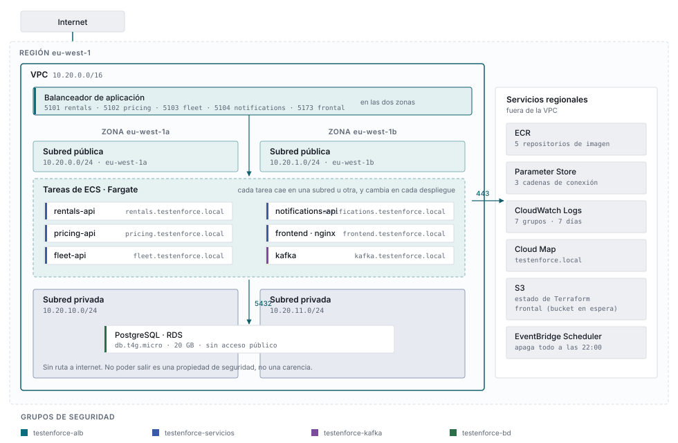
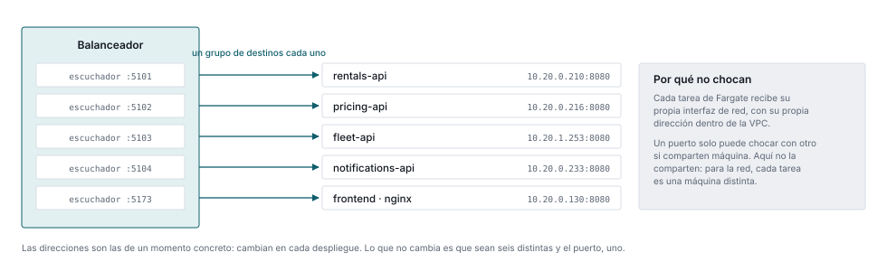
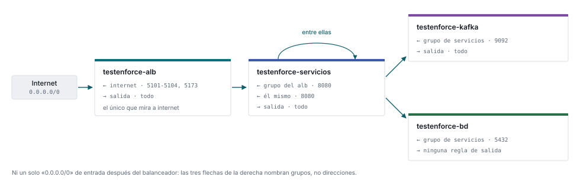
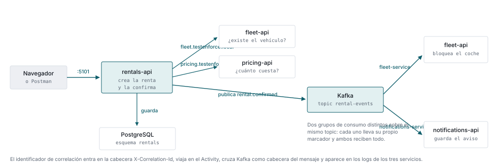
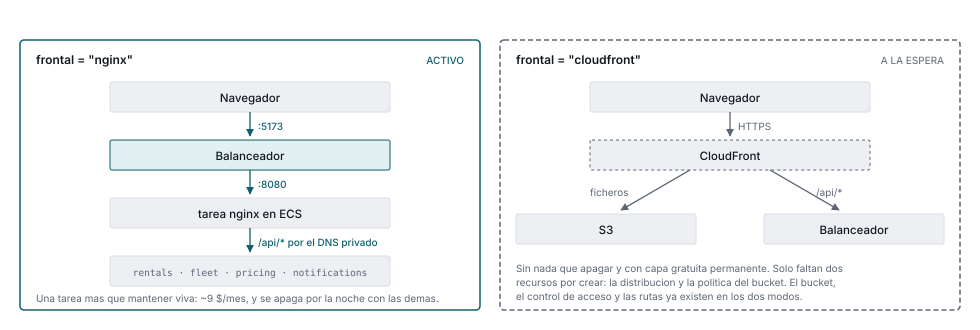

# La arquitectura desplegada en AWS

Qué hay montado ahora mismo en la cuenta, cómo está conectado y por qué. Es la foto
complementaria de [`AWS.md`](AWS.md): allí están las decisiones y el coste, aquí la forma.

Los diagramas salen de [`arquitectura.html`](arquitectura.html), la versión de este mismo
documento pensada para leerse en el navegador, y se hornean como `.svg` en
[`img/`](img/). Las direcciones IP que aparecen son de un momento concreto —cambian en
cada despliegue— y así está dicho donde toca.

---

## 1. La topología

Dos zonas de disponibilidad, porque tanto el balanceador como el grupo de subredes de
RDS lo exigen. Y dos niveles: lo que puede salir a internet y lo que no.

<picture>
  <source media="(prefers-color-scheme: dark)" srcset="img/topologia-oscuro.svg">
  
</picture>

Las tareas aparecen en **una sola banda** a propósito: en qué subred cae cada una lo
decide Fargate, y cambia en cada despliegue. Lo que no cambia es su nombre en el DNS
privado, que es además por donde se llaman entre ellas.

### Por qué las tareas están en subredes públicas

Sin NAT Gateway —32 $/mes— una tarea en subred privada no podría descargar su imagen de
ECR ni escribir en CloudWatch. Se les da IP pública y se cierra la puerta con grupos de
seguridad: **ninguno admite entrada desde internet**.

Es un compromiso consciente del entorno de aprendizaje. En producción irían en privadas,
con NAT o con *VPC endpoints*.

PostgreSQL sí está en subredes sin ruta de salida. No poder salir es una propiedad de
seguridad, no una carencia.

---

## 2. Una puerta por servicio fuera, la misma dentro

Todas las tareas escuchan en el **8080** y ninguna choca con las demás. No es un
descuido: es lo que significa `network_mode = "awsvpc"`.

<picture>
  <source media="(prefers-color-scheme: dark)" srcset="img/puertos-oscuro.svg">
  
</picture>

Se confunden dos números que se llaman igual:

| | Quién lo abre | Cuántos hay |
|---|---|---|
| **5101, 5102, 5103, 5104, 5173** | El **balanceador** | Uno por servicio |
| **8080** | **Cada tarea**, por dentro | Siempre el mismo |

Los 51xx son puertas del **mismo edificio**: el balanceador es uno solo y no puede tener
dos puertas con el mismo número. El 8080 es la puerta **de cada tarea**, y cada tarea es
un edificio aparte: con `awsvpc`, cada una recibe su propia interfaz de red con su propia
dirección dentro de la VPC.

Un puerto no es un recurso de la subred: es un recurso de una dirección. Dos puertos solo
chocan si están en la misma. Con EC2 y `network_mode = "bridge"` sí compartirían los
puertos del host, y entonces habría que darles números distintos.

Es exactamente lo que hace el `docker-compose` en local:

```yaml
ports:
  - "5102:8080"   # izquierda fuera, derecha dentro
```

### Por qué 8080 y no 80

Los puertos por debajo de 1024 solo los puede abrir `root`. Como ningún contenedor del
proyecto corre como `root`, todos escuchan por encima de esa frontera: las imágenes de
.NET traen `ASPNETCORE_URLS=http://+:8080` y el frontal usa la variante *unprivileged* de
nginx, que también escucha en 8080.

---

## 3. Quién puede hablar con quién

Un grupo de seguridad no es un muro alrededor de una máquina: es una **lista de lo que se
permite**, y todo lo que no está en la lista se descarta. No existe una regla de
«prohibir» — existe no haber escrito la de permitir.

<picture>
  <source media="(prefers-color-scheme: dark)" srcset="img/grupos-de-seguridad-oscuro.svg">
  
</picture>

### Las reglas, una por una

Leídas de la cuenta con `aws ec2 describe-security-group-rules`, no de los ficheros `.tf`.

| Grupo | Sentido | Puerto | Origen o destino | Para qué |
|---|---|---|---|---|
| `testenforce-alb` | Entrada | 5101 · 5102 · 5103 · 5104 · 5173 | `0.0.0.0/0` | La única puerta abierta a internet, una por servicio |
| `testenforce-alb` | Salida | todo | `0.0.0.0/0` | Alcanzar a las tareas, estén donde estén |
| `testenforce-servicios` | Entrada | 8080 | grupo `testenforce-alb` | Solo el balanceador entra. Internet, nunca |
| `testenforce-servicios` | Entrada | 8080 | él mismo | Rentals llama a Fleet y a Pricing por el DNS privado |
| `testenforce-servicios` | Salida | todo | `0.0.0.0/0` | Descargar imágenes de ECR, resolver DNS, escribir logs |
| `testenforce-kafka` | Entrada | 9092 | grupo `testenforce-servicios` | Publicar y consumir. Nadie más lo alcanza |
| `testenforce-kafka` | Salida | todo | `0.0.0.0/0` | Descargar su imagen y escribir logs |
| `testenforce-bd` | Entrada | 5432 | grupo `testenforce-servicios` | PostgreSQL, solo desde las tareas |
| `testenforce-bd` | Salida | — | — | **No hay ninguna**: la base de datos no puede iniciar nada |

### ¿Y cómo contesta la base de datos, si no tiene salida?

Porque los grupos de seguridad **tienen memoria**. Cuando aceptan una conexión de
entrada, la respuesta a esa misma conexión vuelve permitida, sin necesidad de ninguna
regla de salida.

Así que «sin salida» no significa muda: significa que puede *responder* a quien le habla,
pero no puede *llamar* a nadie por su cuenta. Si alguien lograse ejecutar algo dentro de
esa máquina, no tendría por dónde sacar lo que encuentre.

### Por qué se nombran grupos y no direcciones

Una tarea de Fargate estrena IP cada vez que se despliega. Una regla escrita contra
`10.20.1.49` caduca en el siguiente despliegue, y la tentación entonces es ampliarla a
toda la subred — que es exactamente cómo una red acaba abierta por dentro.

```hcl
resource "aws_vpc_security_group_ingress_rule" "servicios_entre_si" {
  security_group_id            = aws_security_group.servicios.id
  referenced_security_group_id = aws_security_group.servicios.id   # a sí mismo
  from_port                    = 8080
  to_port                      = 8080
  ip_protocol                  = "tcp"
}
```

La pertenencia a un grupo sobrevive: la tarea nueva nace ya dentro de él. La regla se
escribe una vez y sigue siendo cierta.

---

## 4. El recorrido de una petición

Crear y confirmar una renta toca casi todo el sistema. Este es el camino real, el mismo
que se puede seguir en CloudWatch filtrando por un identificador de correlación.

<picture>
  <source media="(prefers-color-scheme: dark)" srcset="img/recorrido-oscuro.svg">
  
</picture>

Las dos consultas síncronas van por el DNS privado, sin salir a internet. La publicación
es asíncrona: Rentals no espera a que nadie la consuma, y por eso añadir un consumidor no
exige tocar Rentals.

El identificador de correlación entra en la cabecera `X-Correlation-Id`, viaja en el
`Activity`, cruza Kafka como cabecera del mensaje y aparece en los logs de los tres
servicios. Cómo consultarlo está en [`KAFKA.md`](KAFKA.md).

---

## 5. El frontal, y el interruptor que lo mueve

Es la única pieza con dos formas posibles. CloudFront está bloqueado hasta que AWS
verifique la cuenta, así que se sirve con nginx — pero el código de los dos caminos
convive detrás de una variable.

<picture>
  <source media="(prefers-color-scheme: dark)" srcset="img/frontal-oscuro.svg">
  
</picture>

```hcl
frontal = "nginx"       # activo: una tarea de ECS más, detrás del balanceador
frontal = "cloudfront"  # cuando AWS verifique la cuenta
```

La misma variable la leen **los cuatro workflows** (`terraform-plan`, `terraform-apply`,
`terraform-destroy` y `desplegar`) a través de la variable de repositorio `FRONTAL`. Con
dos fuentes de verdad, Terraform crearía una cosa y el pipeline desplegaría otra.

Cambiar de modo es cambiar esa variable: en `cloudfront` solo quedan **dos recursos** por
crear —la distribución y la política del bucket—, porque el bucket, el control de acceso
y las rutas de origen se crean en los dos modos.

### La misma imagen en los dos sitios

El nginx que corre en local y el que corre en AWS son el mismo contenedor. Lo que cambia
son variables de entorno:

| | DNS | Nombre del vecino |
|---|---|---|
| `docker compose` | el interno de Docker | `rentals-api` |
| Fargate | el de la VPC | `rentals.testenforce.local` |

Por eso su configuración es una plantilla que la imagen procesa al arrancar, y no un
fichero fijo. `NGINX_ENTRYPOINT_LOCAL_RESOLVERS=1` hace que lea su propio
`/etc/resolv.conf`, así que acierta en los dos sitios sin que nadie se lo diga.

---

## 6. El inventario

| Recurso | Qué es | Detalle |
|---|---|---|
| VPC | La red privada | `10.20.0.0/16` |
| Subredes públicas | Donde viven las tareas | `10.20.0.0/24` · `10.20.1.0/24` |
| Subredes privadas | Donde vive la base de datos | `10.20.10.0/24` · `10.20.11.0/24` |
| Balanceador | La entrada pública | 5 escuchadores: 5101-5104 y 5173 |
| Clúster ECS | Donde corren los contenedores | Fargate · 6 servicios |
| RDS | PostgreSQL compartido | `db.t4g.micro` · 20 GB · una zona |
| ECR | Registro de imágenes | 5 repositorios, 10 versiones cada uno |
| Cloud Map | DNS privado interno | `testenforce.local` · 6 nombres |
| Parameter Store | Cadenas de conexión cifradas | 3 parámetros `SecureString` |
| CloudWatch Logs | Los logs de todo | 7 grupos · retención 7 días |
| S3 | Estado de Terraform y frontal | 2 buckets |
| EventBridge Scheduler | El apagado nocturno | 7 citas · 22:00 Europe/Madrid |
| CloudFront | El otro modo del frontal | Bloqueado: falta verificación de cuenta |

### Lo que no hay, y es deliberado

| Ausente | Por qué | Ahorro |
|---|---|---|
| NAT Gateway | Tareas en subredes públicas con grupos cerrados | 32 $/mes |
| MSK | Kafka corre como una tarea más de ECS | 110-530 $/mes |
| Route 53 y ACM | Sin dominio propio; se usa el DNS del balanceador | ~13 $/año |
| Multi-AZ en RDS | La alta disponibilidad duplica el precio | ~13 $/mes |
| EFS para Kafka | Disco efímero: Kafka es transporte, no almacén | ~3 $/mes |

**Coste encendido:** unos 0,08 $/hora entre las seis tareas, el balanceador y la base de
datos. **Apagado:** quedan el balanceador (~16 $/mes, no admite apagarse) y el disco de
RDS (~2 $/mes). Para llegar a cero hace falta destruir, que es el nivel 2 del interruptor
descrito en [`AWS-GITOPS.md`](AWS-GITOPS.md).

---

## 7. Lo que costó poner el frontal en verde

Tres despliegues fallidos, y cada uno destapó el siguiente. Vale la pena dejarlos
escritos porque los tres tenían la misma forma.

| Fallo | Síntoma | Causa |
|---|---|---|
| Configuración atada a Docker | `/api/*` agotaba el tiempo, `/` respondía 200 | `resolver 127.0.0.11` y upstreams con nombres de compose, que en Fargate no existen |
| El frontal, construido como un .NET | `lstat src/Frontend: no such file or directory` | La excepción estaba **al lado** del bucle en vez de dentro |
| Variables que nunca llegaban | `nginx: [emerg] unknown "api_rentals" variable` | `ignore_changes = [container_definitions]` ignoraba también entorno, secretos y sondas |

La forma común: **algo que era cierto en local dejaba de serlo en AWS, y nada lo
comprobaba.** Un plan de Terraform en verde no dice que la aplicación funcione, y una
sonda de contenedor que solo pregunta por `/health` tampoco: contesta que el proceso vive,
no que alcance a sus vecinos.

Lo que acabó destapando el primero fueron **las pruebas de humo**, en cuanto se les
permitió mirar el frontal. Antes se saltaban enteras en AWS porque exigían servicios que
allí no están desplegados — es decir, se saltaban justo donde el código es distinto.

> Una prueba que se salta donde el código cambia no está cubriendo nada.
> Solo da la sensación de que sí.

---

## Regenerar los diagramas

[`arquitectura.html`](arquitectura.html) es la fuente. Los `.svg` se hornean de ahí:
se sustituyen las variables CSS por sus valores literales, un fichero por tema, y este
documento elige con `<picture>` según el tema de quien lee.

```bash
python docs/img/generar.py
```

**Los `.svg` no se editan a mano.** Se edita el HTML y se vuelve a correr eso.
